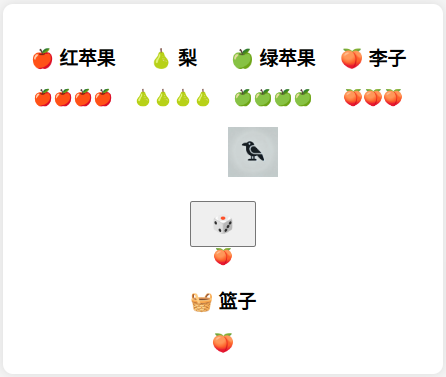

以下是一个适用于你当前项目的 `README.md` 文件模板。这个文档提供了项目的概述、安装和使用指南，以及一些其他重要信息。

```markdown
# 乌鸦与果园游戏

## 项目概述

**乌鸦与果园** 是一个简单有趣的网页游戏，玩家通过掷骰子来摘取果园中的水果，同时与乌鸦比赛，看谁能先完成目标。游戏由HTML、CSS和JavaScript实现，不依赖于任何后端服务。

### 游戏规则

- 游戏开始时，每棵树上有4个水果（红苹果、梨、绿苹果、李子）。
- 乌鸦离果园有5步的距离。
- 玩家每轮掷骰子，可能的结果包括：
  - 🍎 红苹果：从红苹果树上摘取一个红苹果。
  - 🍐 梨：从梨树上摘取一个梨。
  - 🍏 绿苹果：从绿苹果树上摘取一个绿苹果。
  - 🍑 李子：从李子树上摘取一个李子。
  - 🐦‍⬛ 乌鸦：乌鸦前进一步。
  - 🧺 篮子：玩家可以从任意一棵树上摘取一个水果。
- 胜利条件：
  - 若乌鸦在水果被摘完之前进入果园，乌鸦胜利。
  - 若玩家在乌鸦进入果园前摘完所有水果，玩家胜利。

## 安装与使用

### 克隆项目

使用以下命令克隆此仓库：

```bash
git clone https://github.com/your-username/your-repository-name.git
```

### 运行项目

1. 打开项目文件夹，找到 `index.html` 文件。
2. 用浏览器打开 `index.html` 文件，即可开始游戏。

### 游戏截图



## 开发细节

### 技术栈

- **HTML**: 用于构建网页结构。
- **CSS**: 用于样式设计，布局和美化游戏界面。
- **JavaScript**: 实现游戏的核心逻辑和交互功能。

### 主要功能

- **骰子模拟**: 使用随机数生成骰子结果。
- **动态UI更新**: 根据游戏状态更新树上的水果显示和乌鸦的位置。
- **游戏重置**: 每局游戏结束后自动重置游戏状态。

## 贡献指南

欢迎对本项目进行改进和贡献。如果你有任何建议或发现了bug，请通过GitHub Issues反馈，或直接提交Pull Request。

## 许可证

本项目采用 [MIT License](LICENSE)。

